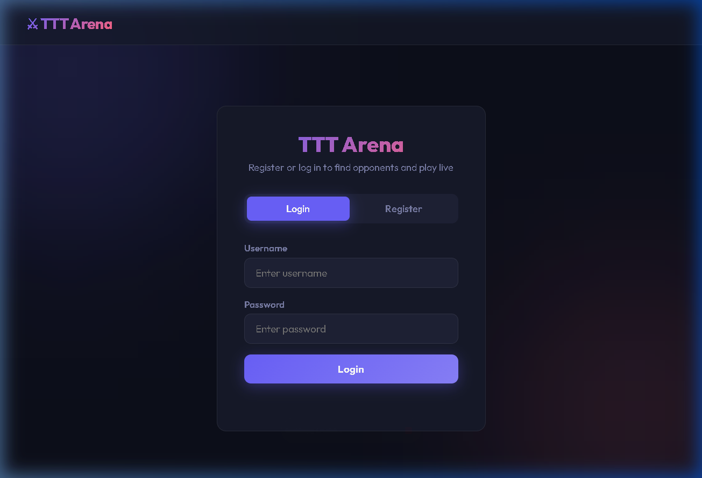
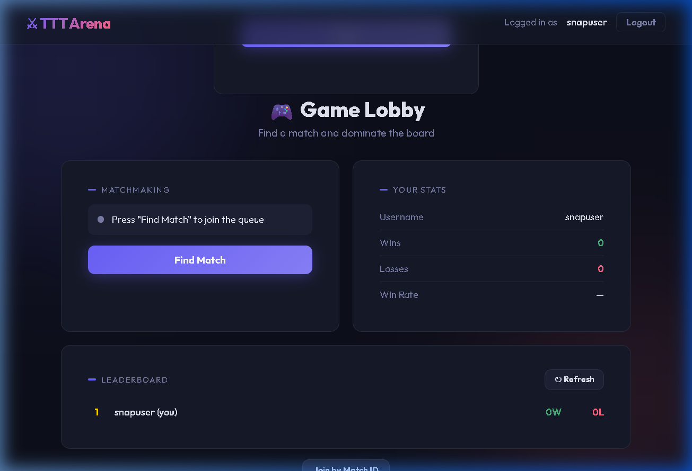
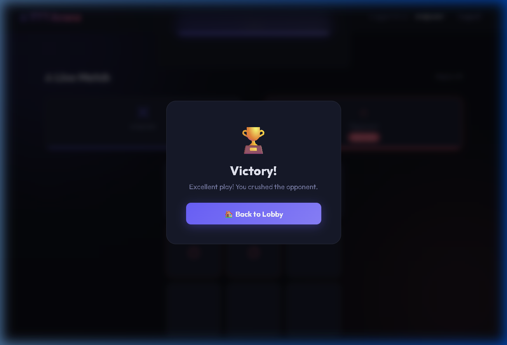

# ⚔️ TTT Arena — Multiplayer Tic Tac Toe

A real-time multiplayer Tic Tac Toe game built with **FastAPI** (backend) and a **vanilla HTML/CSS/JS** frontend. Players register, join a matchmaking queue, and play live via WebSockets.

---

## 📸 Preview

### Login Screen


### Game Lobby


### Game Result


---

## 🗂️ Project Structure

```
ttt_backend/
├── app/
│   ├── main.py                  # FastAPI app entry point (CORS + static files)
│   ├── database.py              # SQLAlchemy engine & session setup
│   ├── models/
│   │   ├── user.py              # User model (id, username, password, wins, losses)
│   │   └── match.py             # Match model (players, board state, status, winner)
│   ├── schemas/
│   │   └── user.py              # Pydantic schemas for register/login
│   ├── auth/
│   │   └── routes.py            # POST /auth/register  POST /auth/login
│   ├── matchmaking/
│   │   └── routes.py            # POST /matchmaking/join  (queue + pending match logic)
│   ├── game/
│   │   ├── routes.py            # WS /ws/game/{match_id}
│   │   ├── engine.py            # check_winner() — all win patterns + draw detection
│   │   └── websocket_manager.py # ConnectionManager — per-match broadcast
│   ├── leaderboard/
│   │   └── routes.py            # GET /leaderboard/
│   └── utils/
│       └── security.py          # bcrypt hash_password / verify_password
├── frontend/
│   └── index.html               # Full SPA — Auth, Lobby & Game screens
├── requirements.txt
├── Dockerfile
├── docker-compose.yml
├── .gitignore
└── game.db                      # SQLite database (auto-created on first run)
```

---

## 🚀 Getting Started

### Prerequisites
- Python 3.10+
- `pip` / `venv`

### 1. Clone & set up environment

```bash
git clone <your-repo-url>
cd ttt_backend

python -m venv .venv

# Windows
.venv\Scripts\activate

# macOS / Linux
source .venv/bin/activate
```

### 2. Install dependencies

```bash
pip install -r requirements.txt
```

### 3. Run the server

```bash
uvicorn app.main:app --host 127.0.0.1 --port 8000 --reload
```

### 4. Open the game

Navigate to **http://127.0.0.1:8000** in your browser.

---

## 🎮 How to Play

1. **Register** two separate accounts (use two browser tabs)
2. **Login** in each tab with a different account
3. Click **"Find Match"** in both tabs
4. Both players are matched automatically and taken to the game board
5. **X always goes first** — click any empty cell to place your mark
6. First to get **3 in a row** wins; board full with no winner = **draw**
7. Wins/losses are recorded and visible on the **Leaderboard**

> **Tip:** You can also click "Join by Match ID" to connect directly using a match number.

---

## 🌐 API Reference

| Method | Endpoint | Description |
|--------|----------|-------------|
| `GET` | `/` | Serves the frontend (`index.html`) |
| `POST` | `/auth/register` | Register a new user `{username, password}` |
| `POST` | `/auth/login` | Login → returns `{user_id}` |
| `POST` | `/matchmaking/join?user_id=N` | Join matchmaking queue or retrieve match |
| `WS` | `/ws/game/{match_id}` | Real-time game WebSocket |
| `GET` | `/leaderboard/` | All users sorted by win count |

### Example: Register

```bash
curl -X POST http://127.0.0.1:8000/auth/register \
  -H "Content-Type: application/json" \
  -d '{"username": "alice", "password": "secret"}'
```

### Example: Login

```bash
curl -X POST http://127.0.0.1:8000/auth/login \
  -H "Content-Type: application/json" \
  -d '{"username": "alice", "password": "secret"}'
# Response: {"message": "Login success", "user_id": 1}
```

### WebSocket Message Format

**Client → Server** (make a move):
```json
{ "position": 4 }
```
Positions are 0–8, mapped left-to-right, top-to-bottom:
```
0 | 1 | 2
3 | 4 | 5
6 | 7 | 8
```

**Server → Client** (game state update):
```json
{
  "board":  ["X", "", "O", "", "X", "", "", "", ""],
  "winner": null
}
```
`winner` is `"X"`, `"O"`, `"draw"`, or `null` (game still in progress).

---

## 🐳 Docker

### Build & run with Docker Compose

```bash
docker-compose up --build
```

The app will be available at **http://localhost:8000**.  
The SQLite database is mounted from the host so data persists across restarts.

### Build manually

```bash
docker build -t ttt-arena .
docker run -p 8000:8000 ttt-arena
```

---

## 🗄️ Database

Uses **SQLite** via SQLAlchemy. The file `game.db` is auto-created in the project root on first run. Tables:

| Table | Columns |
|---|---|
| `users` | `id`, `username`, `password` (bcrypt), `wins`, `losses` |
| `matches` | `id`, `player_x`, `player_o`, `board_state`, `status`, `winner` |

`board_state` is stored as a comma-separated string of 9 values, e.g. `"X,,O,,,X,,,"`

---

## 🛠️ Tech Stack

| Layer | Technology |
|---|---|
| Backend framework | [FastAPI](https://fastapi.tiangolo.com/) |
| ASGI server | [Uvicorn](https://www.uvicorn.org/) |
| Database ORM | [SQLAlchemy](https://www.sqlalchemy.org/) |
| Database | SQLite (dev) |
| Password hashing | [passlib](https://passlib.readthedocs.io/) + bcrypt |
| Real-time comms | WebSockets (via `websockets` library) |
| Frontend | Vanilla HTML / CSS / JavaScript |
| Containerisation | Docker + Docker Compose |

---

## ⚠️ Known Limitations & Notes

- **In-memory matchmaking queue** — the queue resets on every server restart. A production system should use Redis or a database-backed queue.
- **No authentication tokens (JWT)** — `user_id` is passed directly as a query param. Add JWT for production use.
- **SQLite** is single-file and not suited for concurrent multi-instance deployments. Swap for PostgreSQL for production.
- **bcrypt pin** — `bcrypt==4.0.1` is pinned because `passlib 1.7.4` is incompatible with bcrypt ≥ 4.1. Either upgrade passlib or use `bcrypt==4.0.1`.

---

## 📄 License

MIT — free to use, modify, and distribute.
