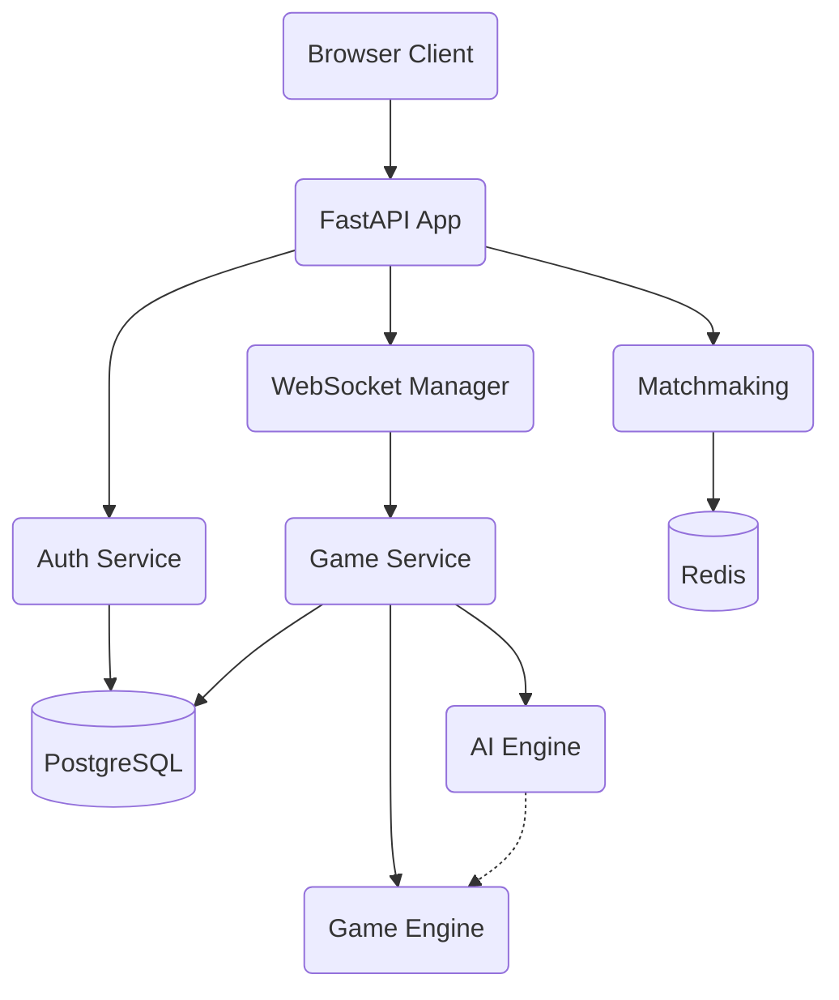

# ⚔️ TTT Arena — Real-Time Multiplayer Tic-Tac-Toe

A production-quality real-time multiplayer Tic-Tac-Toe game platform. Built with a FastAPI backend connected to PostgreSQL and Redis, offering authoritative game logic, full Elo rating, match history replays, JWT authentication, and Minimax-powered AI.

---

## 🚀 Demo
*(Live application link placeholder)*

---

## ✨ Features

- **Real-time multiplayer**: WebSocket-powered server-authoritative engine handling connections gracefully.
- **AI opponent**: Four levels ranging from Easy (Random) to Impossible (Minimax + Alpha-Beta Pruning).
- **Matchmaking**: Redis-backed player queue supporting concurrent user matchmaking.
- **Private Rooms**: Generate unique 6-character room codes to challenge friends.
- **Competitive Ranking**: Full Elo rating system tracking wins, streaks, losses, and win rates.
- **Match History & Replay**: Detailed move-by-move match storage allows reconstruction/replaying of completed games.
- **Reconnection Support**: Grace-period mechanisms to gracefully resume matches if a client disconnects briefly.
- **Production Engineering**: Automated PyTest suites, JWT refresh flows, Alembic migrations, and full Dockerization.

---

## 🏗️ Architecture



### AI Architecture

- **Easy**: Random available move.
- **Medium**: Immediate win detection, defensive block detection, center preference, and corner heuristics.
- **Hard**: Medium heuristics plus fork creation/prevention.
- **Impossible**: Full Minimax search algorithm with Alpha-Beta pruning, ensuring it never loses.

---

## 🗄️ Database Schema

Entities mapped via SQLAlchemy and managed by Alembic:

- `users` (id, username, password_hash, stats, rating, streak tracking)
- `games` (id, type, players, difficulty, status, board_state (JSON), turn, winner)
- `game_events` (id, game_id, player_id, symbol, position, sequence timing for Replays)
- `refresh_tokens` (id, user_id, token hash, expiration)

---

## 🌐 API

- `POST /auth/register`: Create account
- `POST /auth/login`: Return JWT token
- `POST /matchmaking/join`: Poll Redis queue to retrieve a match ID
- `POST /rooms/create`: Initialize a private match via 6-char code
- `POST /rooms/join`: Join private match
- `GET /leaderboard`: Retrieve top users by Rating
- `GET /users/{username}`: Fetch detailed user statistics profile

---

## 📡 WebSocket Protocol

Connected to `wss://{host}/ws/game/{match_id}?token={jwt_token}`.

**Client ➡️ Server Events:**
```json
{
  "type": "move",
  "position": 4
}
```
*(Also accepts: `rematch_request`, `rematch_decline`)*

**Server ➡️ Client Events:**
```json
{
  "type": "game_state",
  "game_id": 1,
  "board": ["X", "", "O", "", "X", "", "", "", ""],
  "current_turn": "O",
  "status": "active",
  "winner": null,
  "winning_line": null,
  "version": 3,
  "turn_timer": 30
}
```
*(Other broadcasts: `error`, `player_joined`, `opponent_disconnected`, `rematch_requested`, etc)*

---

## 🐳 Docker

Run the entire stack instantly.

```bash
docker-compose up --build
```
PostgreSQL, Redis, and the FastAPI application will boot concurrently.

---

## 🧪 Testing

The backend includes a comprehensive `pytest` suite ensuring robust integration:

```bash
# Setup python environment
python -m venv .venv
source .venv/bin/activate
pip install -r requirements.txt

# Run full suite
pytest tests/
```

Tests cover Auth dependencies, structured Websocket broadcast concurrency, Game Engine win states, and the deterministic properties of the AI layers.

---

## 💡 Architecture Decisions

- **PostgreSQL**: Selected for robust concurrent transaction properties, protecting GameEvents generation accurately.
- **Redis**: Ideal for rapid enqueueing/dequeuing Matchmaking queue states without hammering persistent SQL, and to implement strict Rate Limiting easily.
- **WebSockets**: Crucial for instant game-state synchronization between two clients, preventing API polling fatigue.
- **JWT**: Eliminates risky state tampering (e.g. `?user_id=123` parameter exploits).
- **Minimax**: Since Tic-Tac-Toe state space is tiny, a depth-first heuristic search fully maps the decision tree to perfection seamlessly.